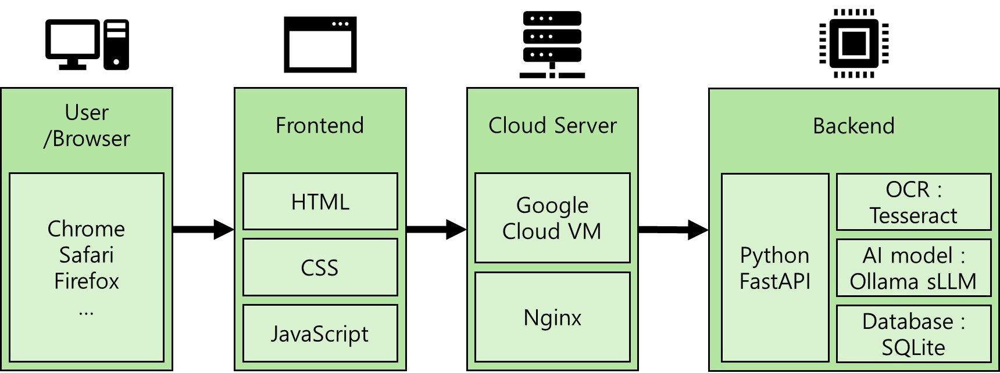
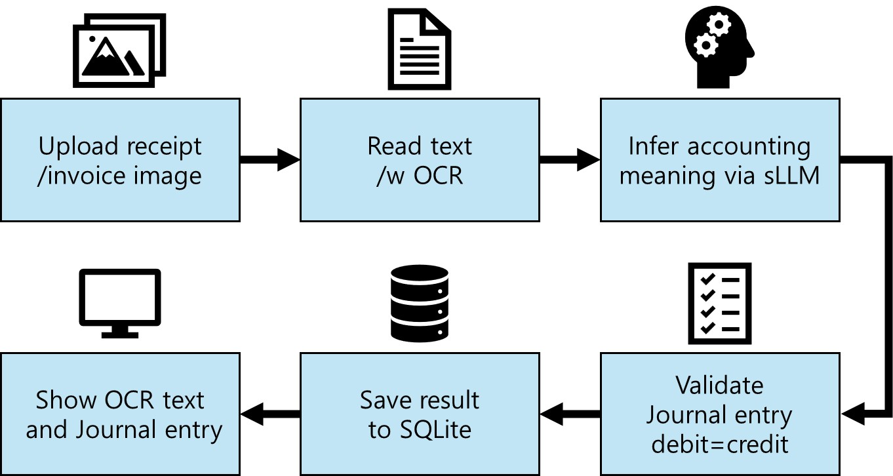

<!-- _class: titlepage -->

# Journalizing Automation

## Based on OCR and sLLM

Team 3  
Principles of Accounting Project

---

# 1. Problem

## Current Problems in Accounting

- Manual journalizing takes too much time
- Human errors can occur during repetitive work
- Companies process many invoices and receipts every day
- Repetitive accounting tasks reduce efficiency

---

# 2. Why OCR + sLLM?

## Two Technologies, Two Roles

- **OCR** reads text from receipt or invoice images
- **sLLM** understands the transaction context
- Together, they can generate draft journal entries

**Goal:** support accountants, not replace them

---

# 3. System Structure

## Main Parts of Our Project

- **Frontend:** user upload screen and result display
- **Backend:** OCR, AI inference, validation, and saving
- **Deployment:** cloud server for browser access

## Technology Stack

HTML / CSS / JavaScript / FastAPI / Tesseract / Ollama / SQLite / Google Cloud VM

---

# 3. System Structure

---

# 4. Data Flow

---

# 5. Demo Result
### Demo URL : http://34.64.197.230
## Repair Invoice Example

- Uploaded an English repair invoice
- OCR extracted invoice text clearly
- sLLM generated a journal entry draft
- Backend validated debit and credit equality

| Account | Debit | Credit |
| --- | ---: | ---: |
| Office Supplies Expense | 154.06 | 0 |
| Accounts Payable | 0 | 154.06 |

---

# 6. Accounting Concepts

## Concepts Used in Our Project

- **Accounting transaction**
  - The event affects accounting elements and can be measured in money
- **Realization of transaction**
  - The system checks whether the transaction is supported by evidence
- **Journaling**
  - The final output is a debit and credit journal entry draft

---

# 7. Future Usage

## Practical Usefulness

- Reduce time spent on repetitive journalizing
- Help accountants review drafts instead of entering everything manually
- Allow junior accountants to focus on more meaningful tasks
- Support small businesses with limited accounting resources

---

# 8. Limitations

## Current Limits of Our Project

- AI results still need human review
- OCR quality depends heavily on image quality
- Blurry or small text can lead to incorrect results
- AI mistakes can be risky for important transactions

**Current role:** assistant tool, not a fully autonomous accounting system

---

# 9. Future Work

## Possible Improvements

- Improve OCR accuracy
- Strengthen AI validation
- Support multilingual invoice processing
- Add more accounting features
- Expand toward a small AI-based ERP system

---

<!-- _class: lead -->

# Q&A
### Demo URL : http://34.64.197.230
### Github : https://github.com/Saturn294571/Journaling-automation